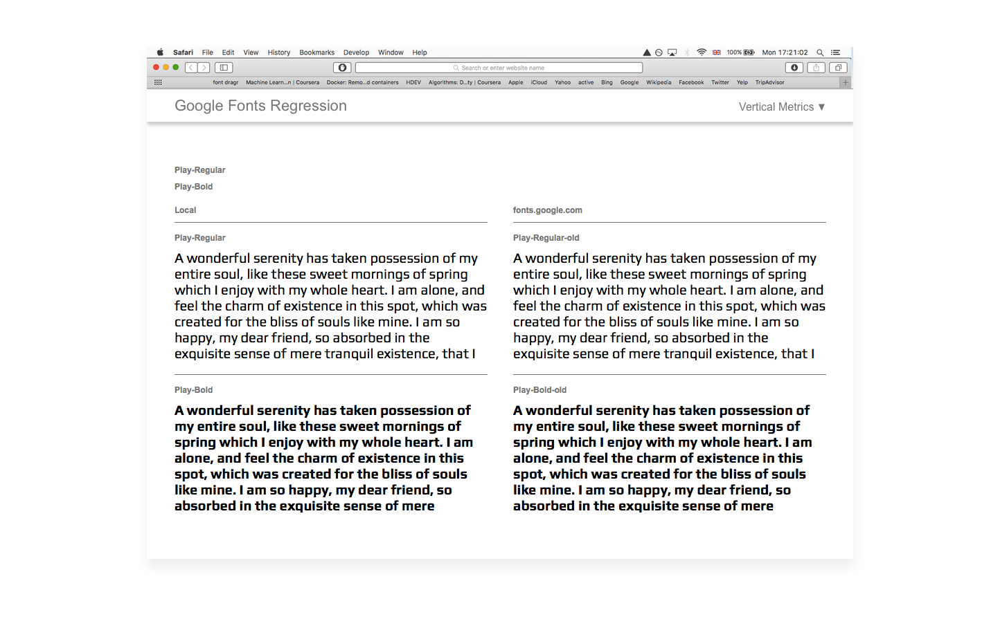

# Vertical Metrics

* [Requirements](#requirements)
* [Concrete cases](#concrete-cases)
* [Useful Tools](#useful-tools)

## Requirements
Throughout countless threads and discussions, the following rules have been established.

### 1. Vertical metrics must not be calculated by the font editor automatically
We don't want this because they all do it differently. 

### 2. Vertical metrics must be consistent across a family
Every font in a family must share the same vertical metric values.

This rule can be voided if a font is being upgraded and previously had inconsistent family metrics. If this is the case, the aim should be to visually match the linespacing of each font, but fix any clipping issues caused by incorrect WinAscent, WinDescent values.

### 3. The following vertical metric parameters must be set for each font in a family

| Ms Spec ttf spec      | Glyphsapp Master customParameter | FontLab              | ufo3 fontinfo.plist      |
| --------------------- | -------------------------------- | -------------------- | ------------------------ |
| [OS/2] sTypoAscender  | typoAscender                     | [OS/2] TypoAscender  | openTypeOS2TypoAscender  |
| [OS/2] sTypoDescender | typoDescender                    | [OS/2] TypoDescender | openTypeOS2TypoDescender |
| [OS/2] sTypoLineGap   | typoLineGap                      | [OS/2] TypoLineGap   | openTypeOS2TypoLineGap   |
|                       |                                  |                      |                          |
| [hhea] Ascender       | hheaAscender                     | [hhea] Ascender      | openTypeHheaAscender     |
| [hhea] Descender      | hheaDescender                    | [hhea] Descender     | openTypeHheaDescender    |
| [hhea] LineGap        | hheaLineGap                      | [hhea] LineGap       | openTypeHheaLineGap      |
|                       |                                  |                      |                          |
| [OS/2] usWinAscent    | winAscent                        | [OS/2] WinAscent     | openTypeOS2WinAscent     |
| [OS/2] usWinDescent   | winDescent                       | [OS/2] WinDescent    | openTypeOS2WinDescent    |

*For brevity, we'll refer to the 3 sets of metrics as Typo, Hhea, Win.* 

### 4. WinAscent and WinDescent values must be the same as the family's tallest/deepest yMin and yMax bbox values
The Microsoft [OpenType specification](https://www.microsoft.com/typography/otspec/os2.htm#wa). Recommends the following:
>If any clipping is unacceptable, then the value should be set to yMax’.

[Overpass issue #33](https://github.com/RedHatBrand/Overpass/issues/33) demonstrates what happens in MS applications when the WinAscent and Descent are not set correctly.

By changing these values, the line height will be increased in MS applications. This is can lead to very loose line heights if the bbox is exceedingly tall. This mainly occurs in families featuring Vietnamese, Devanagari and Arabic or other tall scripts. To counteract this, we enable [Use Typo Metrics](https://www.microsoft.com/typography/otspec/os2.htm#fss) and set the Typo values to match the previous Win values. By swapping the sets, we should retain the previous line heights in Windows as well as remove the clipping.

### 5. [Use_Typo_Metrics](https://www.microsoft.com/typography/otspec/os2.htm#fss) must be enabled
This will force MS Applications to use the Typo values instead of the Win values. By doing this, we can freely set the Win values to avoid clipping and control the line height with the typo values. It has the added benefit of future line height compatibility. When a new script is added, we simply change the Win values to the new yMin and yMax, without needing to worry if the line height have changed. Note that the Use_Typo_Metric flag is also called: fsSelection bit 7 because of its actual name in the OS/2 table:

- In GlyphsApp, set `Use Typo Metrics` custom parameter set to `true` in the **Font** tab of **Font Info**.
- In RoboFont, this is under **Font Info > OpenType > OS/2 Table > fsSelection > USE_TYPO_METRICS**.

### 6. If the family is being updated, the line height must visually match the previous release.
Some applications do not allow users to control the line height/leading of their fonts. Word processors and text editors are common culprits. It is essential their documents do not reflow.

### 7. Hhea and Typo metrics should be equal
Hhea metrics are used in Mac OS X, whilst Microsoft uses Typo when Use_Typo_Metrics is enabled. They should ideally be identical.

This rule can be voided if a font is being upgraded and previously had inconsistent values.

### 8. LineGap values must be 0
The LineGap value is a space added to the lineheight created by the union of the (typo/hhea)Ascender and (typo/hhea)Descender. It is handled differently according to the environment. This leadind value will be added above the text line in most desktop apps. It will be shared above *and* under in web browsers, and ignored in Windows if Use_Typo_Metrics is disabled. For better linespacing consistency accross platforms, (typo/hhea)LineGap values must be 0.

### 9. Uppercases should be centered if the font's primary script has uppercases letterforms such as Latin, Greek and Cyrillic
Web designers will thank you if you managed to have the same space above and under capitals: typoAscender - CapsHeight = abs(typoDescender). It will make easier for them the setting of padding in buttons for example.

### 10. typo/hheaAscender value should be greater than Agrave's yMax
Some Mac applications such as TextEdit will position the first line of text by, either, using the height of the Agrave, or by using the font’s hheaAscender (whichever is taller). To keep the positioning consistent across a family, we require that the hheaAscender is greater than the tallest Agrave in the family. See this issue for further info, https://github.com/googlefonts/fontbakery/issues/3170.

### 11. The sum of the font’s vertical metric values (absolute) should be 20-30% greater than the font’s UPM.

By default, DTP applications such as Indesign will set the line height to be 20% greater than the font’s size (10pt size / 12pt leading). For consistency, we recommend setting the vertical metric values so their sum is in a similar range, for example:

- UPM: `1000`
- (typo/hhea)Ascenders: `900`
- (typo/hhea)Descenders: `-300`
- Total: ascender + abs(descenders) = `1200`

Exceptions are usually made if the font’s primary script isn’t Latin, Greek or Cyrillic. Some scripts such as Devanagari contain very tall and shallow glyphs. It may make more sense for the sum of the metrics to exceed 130% to avoid interline glyph collisions.

### Note
Please keep in mind that this calculation is to be set according to the specificities of each font. 

- `20%` is for compatibility with DTP app, but it can be often to tight if your font is covering more languages than basic Latin, Greek and Cyrillic, or if you have a particular design with short ascenders for example. 

- The choice of the Agrave is purely based on the behaviour of some applications, it is not based on some general rules of design.

- Google Fonts is trying to push designers to include proper support of the mark_to_mark feature allowing combination of diacritics and diplay of non-encoded accented glyphs. Pay attention to your anchor placement so, if you combine breve and acute for example, you don't end up with a severe interline glyph clashing. Or adapt your vertical metrics with a certain measure, to find the best compromise.

- Google Fonts wishes to update fonts to expand glyhpsets, and therefore language support, and therefore accessibility. If your intention is to have, for example, Vietnamese coverage or Thai script in a next update, you can already anticipate the vertical metrics to avoid regressions later.

For more info about the relationship between diacritics and line height, you can read this document: (to do: link Viviana's doc).

---

## Concrete cases

Setting vertical metrics usually falls into the following two categories:

1. Calculating the vertical metrics for a new family
2. Recalculating the vertical metrics for an upgraded family

### 1. Calculating the vertical metrics for a new family

Set these values to be the same across all masters to ensure that output instances have equal vertical metrics:

- `typoAscender` and `hheaAscender` set higher than À
- `typoLineGap` and `hheaLineGap` set to 0
- `typoDescender` and `hheaDescender` set lower than the deepest descender of the primary script.
- `winAscent` and `winDecent` set to `yMax` and `yMin` (absolute highest and lowest point in the font)
- `use_typo_metrics` is enabled 

Expected result: vertical metrics should be around 120-130% of UPM. Anything greater, and the metrics may look too loose.

**Example**

A new Latin family has the following qualities:
- UPM is `1000`
- yMax of tallest `A grave` in the familly (bold for this example) = `940`
- yMin of deepest a-z letter (`g` bold in this family) = `235`
- Caps height (`H`or `Z` bbox height) = `730`
- Family's yMax = `1116` (Bold `A breve hookabove` for this family)
- Family's yMin = `-320` (ExtraLight `c cedilla` for this family)

1. Set the default values, following the schema above:

    - typoAscender = `965`. (`UPM * 1.2 - CapsHeight) / 2 + CapsHeight` which is greater than Agrave, perfect.)
    - typoDescender = `-235`. (`UPM * 1.2 - CapsHeight) / 2` which is equal to deepest letterform)
    - typoLineGap = `0`
    - hheaAscender = `965` (typoAscender)
    - hheaDescender = `-235` (typoDescender)
    - hheaLineGap = `0` (typoLineGap)
    - winAscent = `1116` (Font bbox yMax)
    - winDescent = `320` (*absolute value* of Font bbox yMin ie. a positive integer)

2. Be sure to copy these same metric values to all of the masters in the family
3. Enable Use_Typo_Metrics

### 2. Recalculating the vertical metrics for an upgraded family

Many font families receive upgrades, either by the original author or a 3rd party. When character extensions occur which modify the font's bounding box, the vertical metrics will need to be recalculated. 

Imagine we have a previous v1.000 release. We're now adding Vietnamese. The version number has been bumped to V2.000. The font's bbox yMax has changed from 1000 to 1100 and yMin from -200 to -300.

v1.000 had the following family vertical metrics:

- typoAscender = `800`
- typoDescender = `-200`
- typoLineGap = `200`
- hheaAscender = `800`
- hheaDescender = `-200`
- hheaLineGap = `200`
- winAscent = `1000`
- winDescent = `200`

*Notice each set set adds up to 1200, if the negative integers are converted to positive. This should lead to consistent metrics across each platform*

There are two cases which can occur.

#### I. Use_Typo_Metrics was already enabled in the v1.000 release.
The Win values simply need to reflect the new yMin and yMax values.

1. v2.000 vertical metrics:

    - typoAscender = 800
    - typoDescender = -200
    - typoLineGap = 200
    - hheaAscender = 800
    - hheaDescender = -200
    - hheaLineGap = 200
    - **WinAscent = 1100. Font bbox yMax**
    - **WinDescent = 300. Font bbox yMin (positive integer)**

#### II. Use_Typo_Metrics was not enabled in the previous release.
The Typo Metrics need to inherit the v1.000 Win values. The WinAscent and WinDescent also need to reflect the new yMin and yMax values.

1. v2.000 vertical metrics:

    - **typoAscender = 1000. Old WinAscent**
    - **typoDescender = -200. Old negative WinAscent**
    - **typoLineGap = 0. Win Metrics has no LineGap parameter so we set this to 0**
    - **hheaAscender = 1000 (set as new TypoAscender)**
    - Hhea Descender = -200
    - **hheaLineGap = 0 (consistent with typoLineGap)**
    - **winAscent = 1100. Font bbox yMax**
    - **winDescent = 300. Font bbox yMin (positive integer)**

2. Repeat process for each weight/style if values are not unique in v1.000
3. Enable Use_Typo_Metrics

If the font was previously hosted on fonts.google.com, you can test the upgraded vertical metrics visually match by using [GF Regression](https://github.com/googlefonts/gfregression). You can also use gftools gen-html with the command `gftools gen-html diff --font-before font1.ttf --font-after font2.ttf` if you want to compare two fonts locally.

*Play's vertical metrics being tested, left: Local version, right: fonts.google.com version*

Useful Links:
- [Glyphs' app tuto for vertical metrics](https://glyphsapp.com/learn/vertical-metrics)
- [Kalapi vertical metrics schema](https://groups.google.com/d/msg/googlefonts-discuss/W4PHxnLk3JY/KoMyM2CfAwAJ)
- [Khaled vertical metrics schema](https://groups.google.com/d/msg/googlefonts-discuss/W4PHxnLk3JY/MYgVlQMjAwAJ)

## Useful Tools
### Glyphsapp Scripts
- [gf-glyphs-scripts](https://github.com/googlefonts/gf-glyphs-scripts) 'QA' script includes several vertical metrics checks. 'Fix fonts for GF spec' will automatically update a family's vertical metrics so they visually match a previous release (if it exists). It will also set the values so no clipping will occur on Windows platforms.

### Testing:
- [Impallari/testing](https://github.com/impallari/Font-Testing-Page): Font tester which has no css line-height property set ([live site](http://cyreal.org/Font-Testing-Page))
- [GF Regression](https://github.com/googlefonts/gfregression): Check local fonts against currently hosted versions on fonts.google.com
