# How to design Grade axis masters

By David Berlow

_“OMG, I wish I knew about this before jumping into Grades. I had a feeling that there was a trick”_ – Ilya Ruderman

### What is Grade?

A grade axis (`GRAD`), is a valuable tool in typography for correcting output versus the specification or to satisfy a preference for lighter or dark text, without changing the layout, either horizontally, or the vertical relations of alignments.

One common example of “correcting output versus the specification” is when the default wght is specified, but for some reason of production, is appearing lighter than the default is expected to. Then grade can be adjusted to alter the appearance, back to that of what is expected from the default. How much to adjust is determined subjectively by the typographer, upon previewing the output, to select a corrective value for whatever the restoration of appearance is required.

Here is a depiction of the problem and solution:

_Line 1: The weight the user has selected to use._

_Line 2: What that ends up appearing as as a result of production, display, distance or any other diminishing force._

_Line 3: What line 1 must look like in order to correct the appearance_

_Line 4: Weight the user has selected to use with a correction from the grade axis._

### How does Font Bureau make them?

Start by making a copy of the variable font’s default font, mentally or programmatically locking the advance widths and kerning to the default’s values.

Then change the glyph shapes, either adding stroke weight to create a “positive” or “up” grade that will be the axis max, or subtracting stroke weight for a “negative” or “down” grade that will be the axis min. As this master is combined with all the others in the design space of a variable font, adding grades to every other style, the amount added or subtracted depends on the design space, and how the type designer wants to define it.

To start, consider what is needed to make the min and max grade correct for the default.

Then, extend it for all parts of the design space that need the grade axis to have more range. For example, when the design space has a wide bold style, it will need more travel along the negative grade than the default’s grade min would need. The opposite end of the design space, the thin compressed styles, will equally benefit from more travel along the positive grade than the default would need; but applying that much grade to the wide bold style would close up all the counters and apertures. Similarly, when that grade min is applied to the default, it will produce other unwanted results.

Typographers can be provided additional documentation to be aware about this, but the type designer can also directly mitigate this and create a “safe space”: After making the grade axis broad enough to be able to effect the entire design space, the type designer can add “corner masters” or “duo-vars” (or “trio-vars”) to limit the effect of the grade axis in areas where the default grade range is too big. Find the instance location where the grade is the maximum visually acceptable, and instantiate that location as a master in the design space at the axis extremes. This warps the design space; perhaps in future an ‘avar2’ table will make the need for additional master data unnecessary.

Once values have been selected for min and or max, the letter drawing for a Latin proportionally spaced design, must proceed to satisfy the following rules:

1. The contour of the grade min must remain at or within the contour of the default, and

2. The contour of the grade max must remain at or beyond the contour of the default.

### Caveats

There are few if any exceptions to these rules.

For Latin-like scripts, the major Y alignments of strokes must remain anchored (baseline, x-height (YTLC) and cap height (YTUC), but others can vary slightly (ascenders (YTAS), descenders (YTDS), and other extenders (YTAD, YTDD, etc), and over/undershoots). The total (YTRA) should remain the same.

Then, as evenly as possible, diminish or add weight horizontally, and to vertical stems not aligned to the major alignments. Other stems should be varied according to their alignment and spacing, such that these and the letter’s proportions are least-disturbed.

Examples of character details follow.

Below are the grades of period centered, showing the default contour between he garde minimum and maximum. The alignment is “self-centered” , i.e.independent of any other alignments. So the grades form concentric circles around the default contour’s center.

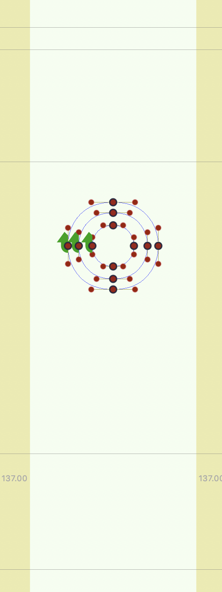
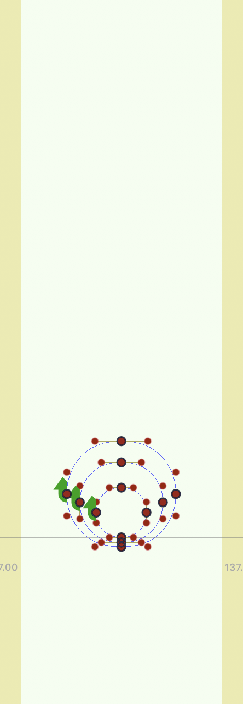

Then beside the period centered, a period, not being self-centered, and with a default of the same size and spacing as center period, should be graded to maintain contact with the baseline.

A sans serif uppercase I, (below left)  has no choice but to stick to the alignments, and then add or remove weight with reciprocal effects on the space. Beside it, with more width due to the serifs, old style types are less prone to damaging spacing with grades.

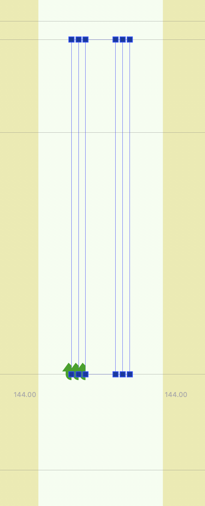
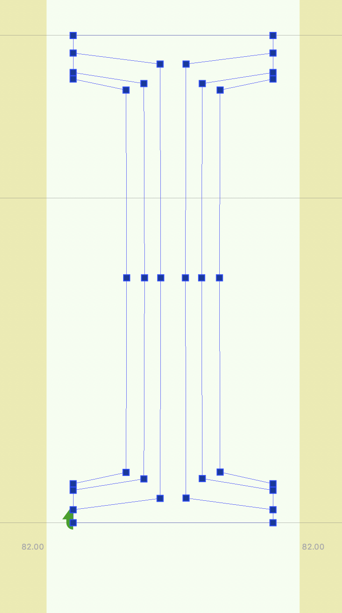

The type designer should not be tempted to make the best optical adjustments for the change of weight, as the grades they draw are not intended to be seen that way.

So below is a Sans E with proper grade:

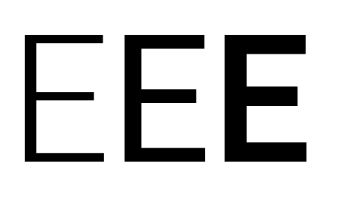

The overlaid contours appear as below left.

If, by contrast, the design changes the lengths of the stroke optically compensate, it might look something like below right.

Then instead of stoke lengths consistent with the default...

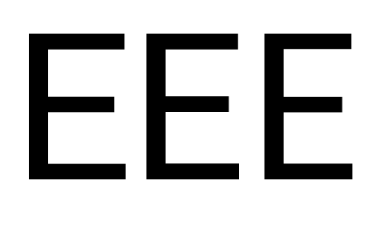

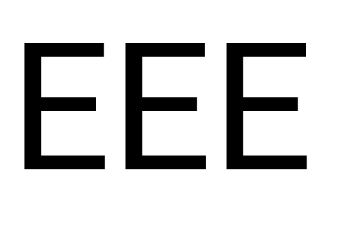

...the character would appear to change width instead.

## Examples

Below are lots of examples of grade masters drawn with various issues (before, left) and correct (after, right)

<table>
<th>before</th><th>after</th>
<tr><td>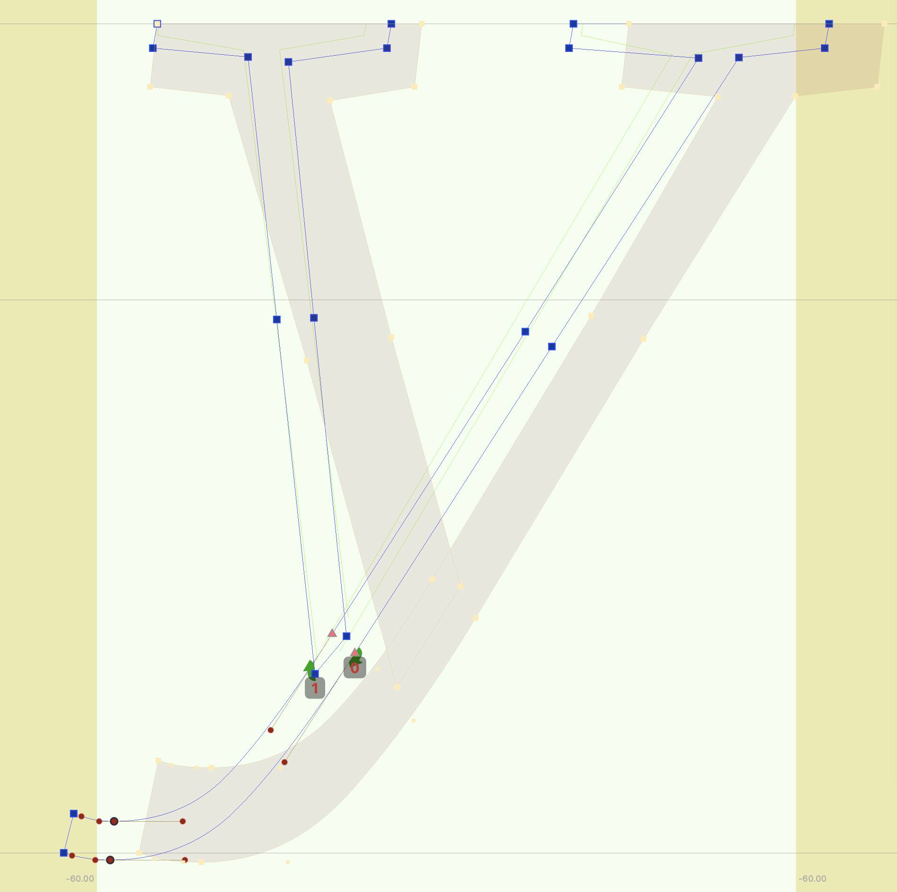 </td><td></td></tr>
<tr><td>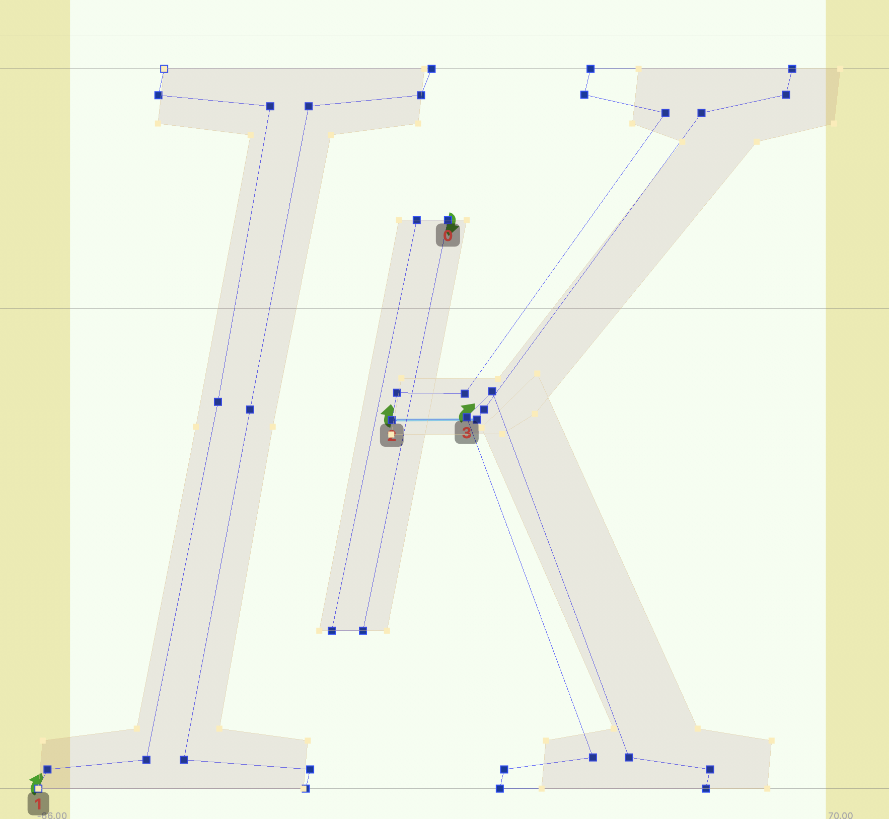</td><td>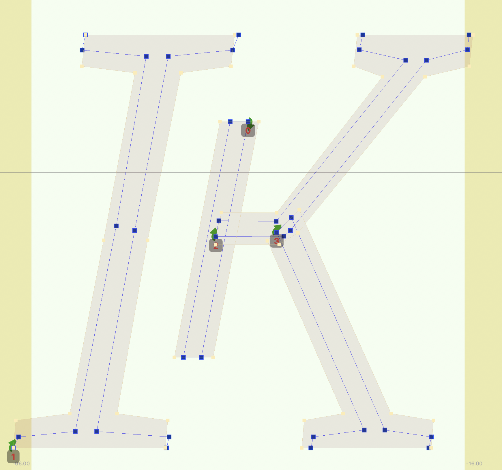</td></tr>
<tr><td>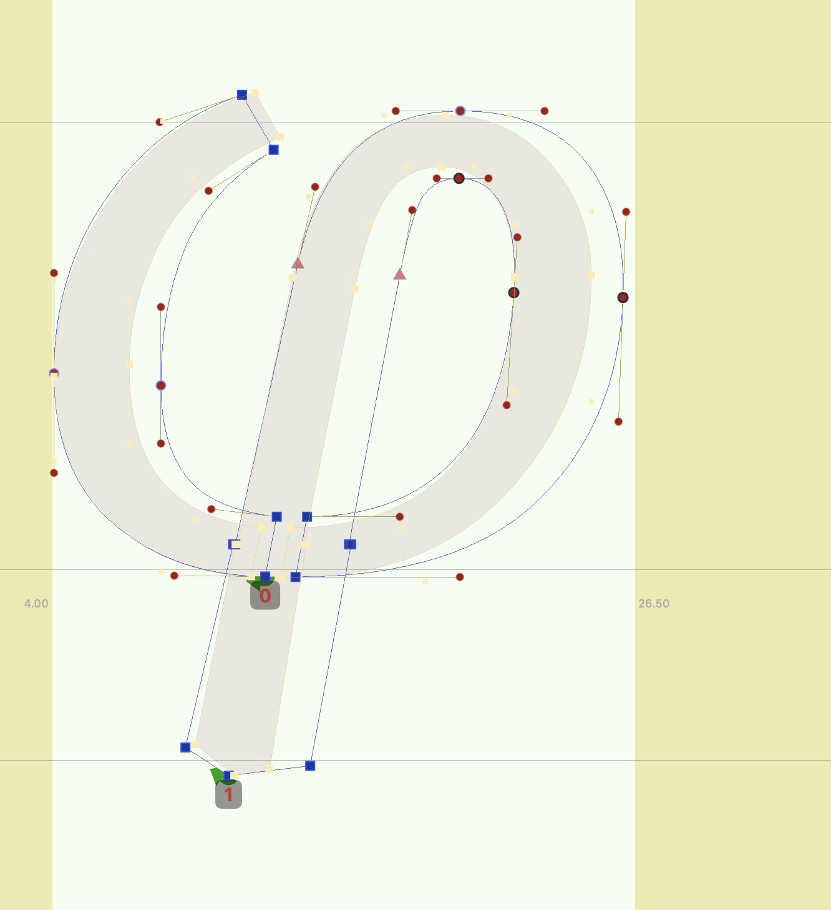</td><td>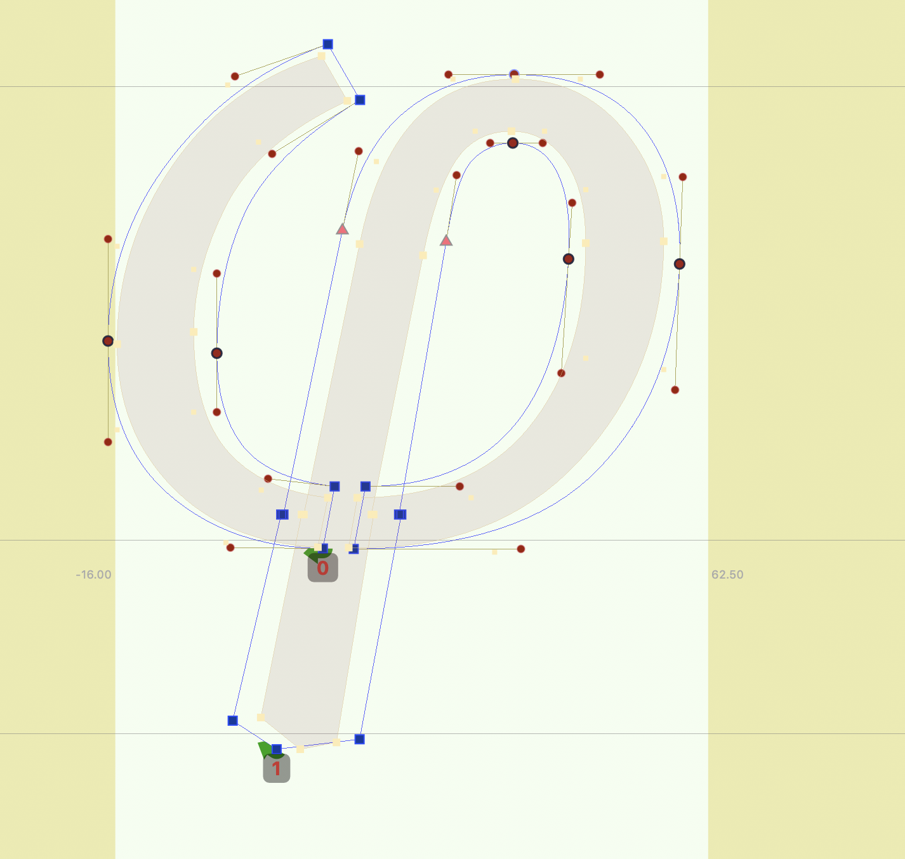</td></tr>
<tr><td></td><td>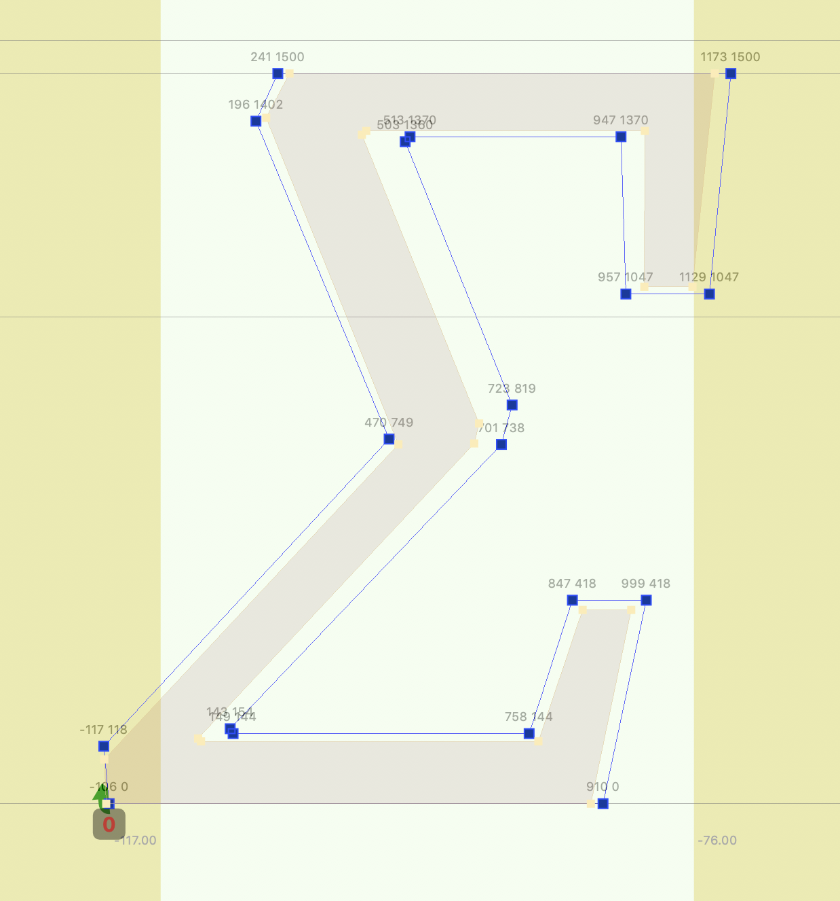</td></tr>
<tr><td>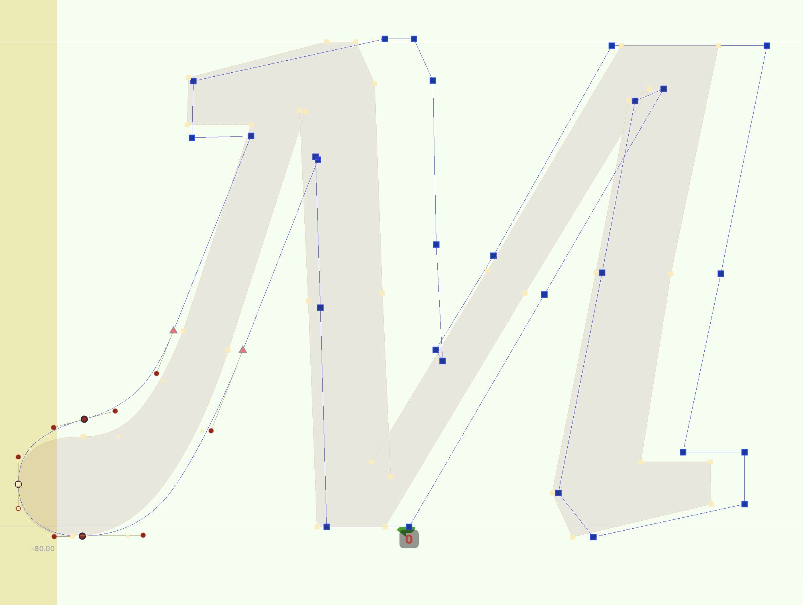</td><td></td></tr>
<tr><td></td><td></td></tr>
</table>
