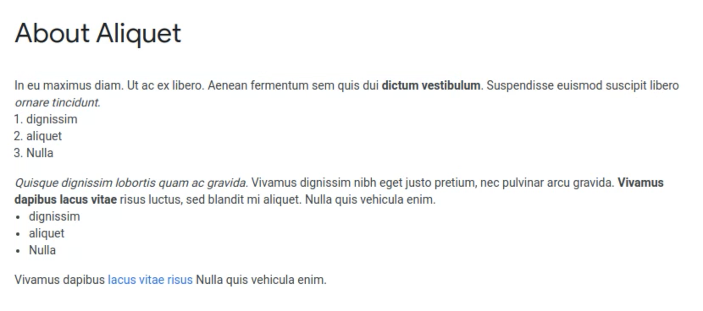

# Google Fonts Docs (WIP)

## Contents

**[Getting started](#getting-started)**
- [Prerequisite knowledge](#prerequisite-knowledge)
- [Tooling](#tooling)
- [Scalable font production](#scalable-font-production)

**[Contributing](#Contributing)**
- [Creating a new family](#creating-a-new-family)
- [Updating an existing family](#updating-an-existing-family)

**[Universal](#universal)**
- [Font copyright](#font-copyright)
- [Font versioning](#font-versioning)
- [Font embedding (fsType)](#font-embedding-fstype)
- [Font vertical metrics](#font-vertical-metrics)
- [Monospace fonts](#monospace-fonts)
- [CJK fonts](#cjk-fonts)

**[Static Fonts](#static-fonts)**
- [Static font filenames](#static-font-filenames)
- [Supported styles](#supported-styles)
- [Single weight families](#single-weight-families)
- [Hinting](#hinting)

**[Variable Fonts](#variable-fonts)**
- [Font Origin](#font-zero-origin)
- [New vs Preexisting](#new-vs-pre-existing)
- [Variable Font filenames](#variable-font-filenames)
- [Axes](#axes)
- [Instances](#fvar-instances)
- [STAT table](#stat-table)
- [VF Hinting](#vf-hinting)

**[Upstream Repos](#upstream-repos)**
- [Upstream Repo Structure](#upstream-repo-structure)

**[The google/fonts repo](#the-googlefonts-repo)**
- [Repository structure](#repository-structure)

**[QA](#qa)**
 - [Our process](#our-process)

[**FAQ**](#todo)

TODO

## Getting started

### Prerequisite knowledge

We expect font developers to understand the following:

- Basic understanding of how OpenType fonts work.
- A fully featured font editor such as Fontlab 7, Glyphsapp, Robofont or Fontforge; not a toy editor like a "handwriting page scan to font" tool fix 
- Version control, specifically git. Use of desktop clients such as Github desktop is acceptable.
- Shell scripting
- Managing python packages/tools using pip

The following resources should bring you up to speed.

- [Microsoft OpenType Specification](https://docs.microsoft.com/en-us/typography/opentype/spec/) (skim read! focus on what each table does)
- [Glyphsapp Tutorials](https://glyphsapp.com/tutorials)
- [Learn the workings of Git, not just the commands](https://developer.ibm.com/technologies/web-development/tutorials/d-learn-workings-git/)
- [Shell scripting basics](https://supportweb.cs.bham.ac.uk/docs/tutorials/docsystem/build/tutorials/unixscripting/unixscripting.html)
- [What is pip](https://realpython.com/what-is-pip/)


### Tooling

Google Fonts has its own freely-available tools, which will help you finalize (generate from source files) and check your families. All our tools are written in Python.

Our tools can be installed using the following terminal commands:

```
pip install gftools
pip install fontbakery
pip install fontmake
```
We recommend installing our tools inside a Python [virtual environment](https://packaging.python.org/guides/installing-using-pip-and-virtual-environments/).


### Scalable font production

Google Fonts is used in approximately a third of all websites (citation needed, it may be more). We treat fonts with the same level of care as we do with software. We must ensure updated fonts do not break existing documents or websites. This requires treating fonts as software. We abide by the following principles:

- Font builds are repeatable
- Fonts can be built in one step
- Fonts can be built on any platform since we use opensource tools
- Projects are kept in version control
- We fix issues before upgrading
- We use CI ([Continuous Integration](https://martinfowler.com/articles/continuousIntegration.html)) for build and testing purposes.
- We have testers with font domain knowledge

#### How we achieve this

- All our font production tools can be run from the commandline. This allows us to write [shell scripts](https://github.com/googlefonts/mavenproFont/blob/main/sources/build.sh) to generate font families.
- We use [fontmake](https://github.com/googlefonts/fontmake) to build our fonts.
- If we need to post process generated fonts, we use our `gftools` fix scripts.
- All of our tools are written in Python. We distribute these tools using [pypi/pip](https://pypi.org/). This allows us to use specific versions of each package. This ensures we're able to get the same results for each build.
- Since we only release Open Source fonts, we expect every family we release to have its own upstream github repository.
- Our main repository [github.com/google/fonts](https://github.com/google/fonts) uses CI. When new fonts are pushed, the CI will run our test suite and the results will be reviewed.

Joel Spolsky's classic article *[The 12 steps to better code](https://www.joelonsoftware.com/2000/08/09/the-joel-test-12-steps-to-better-code/)* illustrates why these requirements are beneficial.

## Contributing

### Creating a new family

- Font Design is original and of high quality
- Fonts and sources are available on Github
- There should only be one set of sources
- Fonts are built using fontmake and can be built in one step
- Project is on Github
- Project follows the [upstream repository structure](#upstream-repo-structure)


### Updating an existing family

- Your modifications must be merged into the upstream project's github repository
- Your modifications must be made to the existing sources.
- No glyphs should be missing
- No styles should be missing
- Visual regressions must be avoided as much as possible.

## Universal

The following applies to all fonts.

### Font copyright

Copright strings should be based on the following schema:

`Copyright { year } The { family } Project Authors ({ git_url })`

e.g

`Copyright 2019 The Oswald Project Authors (https://www.github.com/googlefonts/Oswald)`

If the project is OFL licensed, the first line of the OFL.txt file should be identical to the font copyright string.

Project authors can be specified in an [AUTHORS.txt](https://github.com/JulietaUla/Montserrat/blob/master/AUTHORS.txt) file. Project contributors can be specified in a [CONTRIBUTORS.txt](https://github.com/JulietaUla/Montserrat/blob/master/CONTRIBUTORS.txt) file.


### Font versioning

Versioning is based on [semver](https://semver.org/), apart from we use `MAJOR.SIGNIFICANTMINORPATCH`, instead of `MAJOR.MINOR.PATCH`.

**Examples:**

If a breaking change is made e.g converting a static font family to a variable font family, the MAJOR must be incremented by 1 and the others reset e.g


Current `1.230`, new `2.000`

If a new character set is inserted, SIGNIFICANT should be incremented e.g:

Current `1.230`, new `1.330`


If a few new glyphs are added, MINOR should be incremented e.g:

Current `1.230`, new `1.240`


If a name table record is updated such as the copyright string, PATCH should be incremented e.g:

Current `1.230`, new `1.231`


## Font Embedding (fsType)

Set to `0` (Installable embedding)


## Font Vertical Metrics

See https://github.com/googlefonts/gf-docs/tree/main/VerticalMetrics

### CJK Vertical Metrics

CJK vertical metrics are based on Source Han Sans and Noto CJK fonts.


The following vertical metric values must be applied to all CJK fonts

| Attrib                 | Value                                              | Example using 1000upm font |
|------------------------|----------------------------------------------------|----------------------------|
| OS/2.sTypoAscender     | 0.88 * font upm                                    | 880                        |
| OS/2.sTypoDescender    | -0.12 * font upm                                   | -120                       |
| OS/2.sTypoLineGap      | 0                                                  | 0                          |
| hhea.ascender          | Set to look comfortable (~1.16 * upm)              | 1160                       |
| hhea.descender         | Set to look comfortable (~0.288 * upm)             | -288                       |
| hhea.lineGap           | 0                                                  | 0                          |
| OS/2.usWinAscent       | Same as hhea.ascent                                | 1160                       |
| OS/2.usWinDescent      | abs(value) of hhea.descent                         | 288                        |
| OS/2.fsSelection bit 7 | Do not set                                         |                            |

Our decision to follow the Adobe schema was based on dr Ken Lunde's comments and his release notes on Source Han Sans 

- https://github.com/source-foundry/font-line/issues/2
- [SourceHanSansReadMe.pdf](https://github.com/adobe-fonts/source-han-sans/raw/release/SourceHanSansReadMe.pdf)


## Monospace fonts

We require the post table `isFixedPitch` to be set, and the OS/2 `panose` table to have `OS/2.panose.bProportion` (bit 4) set correctly. If either of these is set incorrectly, users may get fallback glyphs which are not monospaced, if they type a character which doesn't exist in the font.

For monospace fonts:
- Set `post.isFixedPitch` to 1
- If `OS/2.panose.bFamilyType` is 2 (Latin Text), set `OS/2.panose.bProportion` to 9.
- If `OS/2.panose.bFamilyType` is 3 (Latin Script), set `OS/2.panose.bProportion` to 3.
- If `OS/2.panose.bFamilyType` is 5 (Latin Picture), set `OS/2.panose.bProportion` to 3.
- If you are unsure what to set `OS/2.panose.bFamilyType` to, use 2 for "normal" fonts.
- If `OS/2.panose.bFamilyType` is 4, you do not need to worry about `OS/2.panose.bProportion`.

Developers can set these automatically by using the following gftools command:

`gftools fix-isfixedpitch`


## CJK Fonts

CJK fonts have the following additional requirements:

- Vertical metrics should follow the [CJK vertical metrics](#cjk-vertical-metrics) guide


## Static Fonts

“Static” fonts is a way of saying traditional, _non-variable_ fonts.

### Static font filenames

Font filenames must be based on the following schema:

`FamilyName-Style.ttf` e.g `Montserrat-Regular.ttf`

The filename must not contain anything else.


### Supported Styles

Google’s static fonts API supports up to 18 styles in one family: up to 9 weights (Thin–Black), + their matching Italics. The table below lists each style’s specific name table and bit settings.

| Filename                        | Family Name (ID 1, Mac) | Subfamily Name (ID 2, Mac) | Family Name (ID 1, Win) | Subfamily Name (ID 2, Win) | Typographic Family Name (ID 16) | Typo Subfamily Name (ID 17) | OS/2 usWeightClass | OS/2 fsSelection | hhea macStyle |
|---------------------------------|------------------------|---------------------------|------------------------|---------------------------|-------------------------------------|---------------------------------|--------------------|---------------------|----------------|
| FamilyName-Thin.ttf             | Family Name            | Thin                      | Family Name Thin       | Regular                   | Family Name                         | Thin                            | 100                | bit 6               |                |
| FamilyName-ExtraLight.ttf       | Family Name            | ExtraLight                | Family Name ExtraLight | Regular                   | Family Name                         | ExtraLight                      | 200                | bit 6               |                |
| FamilyName-Light.ttf            | Family Name            | Light                     | Family Name Light      | Regular                   | Family Name                         | Light                           | 300                | bit 6               |                |
| FamilyName-Regular.ttf          | Family Name            | Regular                   | Family Name            | Regular                   |                                     |                                 | 400                | bit 6               |                |
| FamilyName-Medium.ttf           | Family Name            | Medium                    | Family Name Medium     | Regular                   | Family Name                         | Medium                          | 500                | bit 6               |                |
| FamilyName-SemiBold.ttf         | Family Name            | SemiBold                  | Family Name SemiBold   | Regular                   | Family Name                         | SemiBold                        | 600                | bit 6               |                |
| FamilyName-Bold.ttf             | Family Name            | Bold                      | Family Name            | Bold                      |                                     |                                 | 700                | bit 5               | bit 0          |
| FamilyName-ExtraBold.ttf        | Family Name            | ExtraBold                 | Family Name ExtraBold  | Regular                   | Family Name                         | ExtraBold                       | 800                | bit 6               |                |
| FamilyName-Black.ttf            | Family Name            | Black                     | Family Name Black      | Regular                   | Family Name                         | Black                           | 900                | bit 6               |                |
|                                 |                        |                           |                        |                           |                                     |                                 |                    |                     |                |
| FamilyName-ThinItalic.ttf       | Family Name            | Thin Italic               | Family Name Thin       | Italic                    | Family Name                         | Thin Italic                     | 100                | bit 0               | bit 1          |
| FamilyName-ExtraLightItalic.ttf | Family Name            | ExtraLight Italic         | Family Name ExtraLight | Italic                    | Family Name                         | ExtraLight Italic               | 200                | bit 0               | bit 1          |
| FamilyName-LightItalic.ttf      | Family Name            | Light Italic              | Family Name Light      | Italic                    | Family Name                         | Light Italic                    | 300                | bit 0               | bit 1          |
| FamilyName-Italic.ttf           | Family Name            | Italic                    | Family Name            | Italic                    |                                     |                                 | 400                | bit 0               | bit 1          |
| FamilyName-MediumItalic.ttf     | Family Name            | Medium Italic             | Family Name Medium     | Italic                    | Family Name                         | Medium Italic                   | 500                | bit 0               | bit 1          |
| FamilyName-SemiBoldItalic.ttf   | Family Name            | SemiBold Italic           | Family Name SemiBold   | Italic                    | Family Name                         | SemiBold Italic                 | 600                | bit 0               | bit 1          |
| FamilyName-Bold.ttf             | Family Name            | Bold Italic               | Family Name            | Bold Italic               |                                     |                                 | 700                | bit 5 + bit 0       | bit 0 + bit 1  |
| FamilyName-ExtraBold.ttf        | Family Name            | ExtraBold Italic          | Family Name ExtraBold  | Italic                    | Family Name                         | ExtraBold Italic                | 800                | bit 0               | bit 1          |
| FamilyName-Black.ttf            | Family Name            | Black Italic              | Family Name Black      | Italic                    | Family Name                         | Black Italic                    | 900                | bit 0               | bit 1          |


If a family has styles which are not in the above table, they should be released as a separate/new family. To do this, append any Unsupported style (e.g Condensed) to the family name, so it becomes part of the family name, rather than part of the style name. We frequently use this approach for [Condensed](https://fonts.google.com/?query=condensed) and [smallcap](https://fonts.google.com/?query=sc) sibling families.

For projects which use glyphsapp, we have an example [repository](https://github.com/davelab6/glyphs-export) which contains glyphs files that are set correctly.


### Single Weight families

If a family is a single weight and it visually doesn't have the appearance of a Regular weight, "One" must be appended to the family name. This approach allows us to keep the desired font name available if we decide to add more styles in the future. We have released many of these [families](https://fonts.google.com/?query=one) in the past.

The single weight families must have the following font specific settings:

| Filename                        | Family Name (nameID 1) | Subfamily Name (nameID 2) | Typographic Family Name (nameID 16) | Typo Subfamily Name (nameID 17) | OS/2.usWeightClass | OS/2.fsSelection | hhea.macStyle |
|---------------------------------|------------------------|---------------------------|-------------------------------------|---------------------------------|--------------------|------------------|---------------|
| FamilyNameOne-Regular.ttf          | Family Name One            | Regular                   |                                     |                                 | 400                | bit 6               |              |


### Hinting

Static fonts should be hinted using the latest version of [ttfautohint](https://www.freetype.org/ttfautohint/). If the results look poor on Windows browsers, it's better to release the fonts unhinted with GASP table set to "grayscale / symmetric smoothing" (0x000A) across the full PPEM range. Ttfautohint often struggles to hint display or handwritten typefaces.

Once the fonts have been hinted, run the fonts through `gftools fix-hinting`. If the fonts are unhinted, run the fonts through `gftools fix-nonhinting`.


## Variable Fonts


### Font (zero) origin

A variable font is simply a static font which has some additional tables FVAR, GVAR etc These new tables allow text clients to visually alter the font so it has a different appearance to end users. Type designers tend to conceive of the variable font as consisting of a bunch of “master fonts” which can then be interpolated between. But in fact, there is only a single master, and what the designer thinks of as additional masters are just sets of instructions to move points around. That single master is the font origin, or in the OpenType Specification the “zero origin.”

Often font developers are unaware what the font origin is within their fonts. They'll then complain that fontbakery is failing many checks. It is recommended that font developers read the [Microsoft OpenType Font Variations Overview](https://docs.microsoft.com/en-us/typography/opentype/spec/otvaroverview) to better understand how a variable font works.


### New vs Pre-existing

#### Family doesn't exist on Google Fonts:
- `VF` must not be appended to the family name.
- Fonts should be unhinted and have `gftools fix-nonhinting` applied to them
- The `wght` axis range must include `400`. e.g. 100-900, 400-900, 100-400 etc
- Other than the above, fonts must conform to the requirements below, like pre-existing fonts

#### Family already exists on Google Fonts

- Family name must be the same
- Hinting should match as closely as possible. If ttfautohint-vf produces bad results, we can release the family unhinted
- Every style that was already available on Google Fonts must be included as an fvar instance
- It should include all glyphs present in the previous version 
- Visual changes should be as minimal as possible
- Fonts must conform to the sections listed below

A good rule to consider is that users should be able to swap the old family with the new VFs and not notice any differences.


### Variable Font filenames

Font filenames must be based on the following schema:

`FamilyName[axis1,axis2].ttf` e.g `Montserrat[wdth,wght].ttf`

Axes should be listed in alphabetical order.

If your font contains unregistered axes, they should be capitalised and be listed first.

`Montserrat[GOOF,VEST,wdth,wght].ttf`

If the family consists of two VFs, one for Italic, the other for Roman. The fonts should named:

    Montserrat[axis1,axis2...].ttf
    Montserrat-Italic[axis1,axis2...].ttf


### Axes

Google Fonts supports all [Microsoft registered axes](https://docs.microsoft.com/en-us/typography/opentype/spec/dvaraxisreg).


### Axis particles

fvar instances and STAT entry particles must be based on the following tables.

**wght**

| name       | wght coordinate value |
|------------|-----------------------|
| Thin       | 100                   |
| ExtraLight | 200                   |
| Light      | 300                   |
| Regular    | 400                   |
| Medium     | 500                   |
| SemiBold   | 600                   |
| Bold       | 700                   |
| ExtraBold  | 800                   |
| Black      | 900                   |
| ExtraBlack | 1000                  |

[MS Spec wght info](https://docs.microsoft.com/en-us/typography/opentype/spec/dvaraxistag_wght)

**wdth**

| name           | wdth coordinate value |
|----------------|-----------------------|
| UltraCondensed | 50                    |
| ExtraCondensed | 62.5                  |
| Condensed      | 75                    |
| SemiCondensed  | 87.5                  |
|                | 100                   |
| SemiExpanded   | 112.5                 |
| Expanded       | 125.0                 |
| ExtraExpanded  | 150.0                 |
| UltraExpanded  | 200.0                 |

[MS Spec wdth info](https://docs.microsoft.com/en-us/typography/opentype/spec/dvaraxistag_wdth)

**opsz**

| name  | opsz coordinate value |
|-------|-----------------------|
| Xpt   | X                     |

X can be any **integer number value**. 
The default value should not be elided in the STAT table (#83).

"Display" or "Banner" or "Micro" are not allowed. 

[MS Spec opsz info](https://docs.microsoft.com/en-us/typography/opentype/spec/dvaraxistag_opsz)

**slnt/ital**

We've disabled these axes due to browser support. Stephen Nixon has [documented](https://arrowtype.github.io/vf-slnt-test/) the issues.


### Fvar instances

We are still revising how we name our instances and which particles we should/must include in instance names. At the moment (2020-06-30), Google Fonts only allows the following named instances:

| | |
|-|-|
| Thin       | Thin Italic       |
| ExtraLight | ExtraLight Italic |
| Light      | Light Italic      |
| Regular    | Italic            |
| Medium     | Medium Italic     |
| SemiBold   | SemiBold Italic   |
| Bold       | Bold Italic       |
| ExtraBold  | ExtraBold Italic  |
| Black      | Black Italic      |


We only allow weight and italic particles. If a font contains additional axes, they must not be mentioned in the instance names and the coordinates for each instance must be set to reasonable default e.g if your font contains a wdth axis, you don't want every instance's wdth coordinate value to be set to Condensed (75) you would set it to Normal (100).

We have imposed this restriction for the following reasons:

- Backwards compatibility with static fonts. Documents won't break if users swap static fonts for variable fonts.
- We don't lock ourselves into an implementation we may want to change in the future. The specs are constantly evolving so it's best we wait for these to mature.
- DTP applications do not properly support variable fonts yet. Variable font support is [experimental in Adobe applications](https://community.adobe.com/t5/indesign/variable-fonts-in-indesign/td-p/10718647).


### STAT Table

All variable fonts must contain a STAT table (style attributes table). This table has several features but a key benefit is it will enable desktop applications to have better font menus. Currently, most font menus only offer a single drop down menu to select a font style. A STAT table enables us to have a drop down menu for each variable font axis.

Creating good STAT tables is complex. Fortunately, we have created a gftools script called `[gftools gen-stat](https://github.com/googlefonts/gftools/blob/main/bin/gftools-gen-stat.py)` which will generate STAT tables for a family automatically based on our [Axis Registry](https://github.com/google/fonts/tree/main/axisregistry).


At the time of writing (2021-05-11), only one desktop application use the STAT table: Microsoft Office for Mac (version 16.46, February 2021 update). However, Indesign, Sketch and other pro type setting applications provide sliders for users to select individual axis locations.

We recommend reading the [MS STAT table spec](https://docs.microsoft.com/en-us/typography/opentype/spec/stat).


### Instantiated Static Fonts

When a variable font is onboarded to Google Fonts, we will provide instantiated static fonts for legacy applications. Thus, bear in mind Google’s API will automatically create all the 100x weights along the used range of the axis when producing static fonts, whether or not they are included in the designer's original design space.


## VF Hinting

Variable Font hinting still doesn't have a clear policy. Marc Foley has been applying the following pattern:

**Family already exists on Google Fonts**

If the family has over a billion weekly views, use [VTT](https://docs.microsoft.com/en-us/typography/tools/vtt/). *TODO Marc Foley. Write more about this. Also include example to Inconsolata once it is finished.*

If the family has under a billion weekly views, try [ttfautohint-vf](https://groups.google.com/d/msg/googlefonts-discuss/WJX1lrzcwVs/SIzaEvntAgAJ). If the results are bad, release unhinted with GASP table set to "grayscale / symmetric smoothing" (0x000A) across the full PPEM range.

If the font has been hinted using VTT or ttfautohint-vf, run the fonts through `gftools fix-hinting` e.g

`gftools fix-hinting Montserrat[wght].ttf`

**Family does not exist on Google Fonts**

Release unhinted. Run fonts through `gftools fix-nonhinting` e.g

`gftools fix-nonhinting Savant[wght].ttf`


## Upstream repos

Font projects must be hosted on Github and must not be private. We don't mind if work-in-progress projects are private but once completed they must be public.


### Upstream Repo Structure

Font projects must have the following structure.

```
.
├── AUTHORS.txt
├── CONTRIBUTORS.txt
├── OFL.txt
├── README.md
├── documentation
│   ├── DESCRIPTION.en_us.html
│   └── promo.png
├── fonts
│   ├── ttf
│   │   └── FontFamily-Regular.ttf
│   └── variable
│       └── FontFamily-[wdth,wght].ttf
├── sources
│   ├── FontFamily-sources.ext
│   └── build.sh
├── requirements.txt
└── .gitignore
```
Each file/dir has the following purpose:

**An example is included for each file. It is better to use these as templates and just modify what you need.**

**[AUTHORS.txt](https://github.com/Omnibus-Type/Texturina/blob/master/AUTHORS.txt):** Includes contact information for the project's authors. Contributors must not be included in this file.

**[CONTRIBUTORS.txt](https://github.com/Omnibus-Type/Texturina/blob/master/CONTRIBUTORS.txt):** Includes contact information for the project's contributors.

**[OFL.txt](https://github.com/Omnibus-Type/Texturina/blob/master/OFL.txt):** The OFL license file. The first line of the license file must contain the font family's copyright string. Copyright notices should match a pattern similar to: "Copyright 2019 The Familyname Project Authors (git url)". It must not include © copyright sign since the CFF table copyright notice key is ascii only.

**[README.md](https://github.com/Omnibus-Type/Texturina/blob/master/README.md):** Contains information about the font family and instructions on how to build the family.

**[documentation](https://github.com/Omnibus-Type/Texturina/tree/master/documentation)**: Directory which contains informations about the Family. You can eventually store there your specimen, the pictures you use for the README.md etc.

**[DESCRIPTION.en_us.html](https://github.com/Omnibus-Type/Texturina/blob/master/documentation/DESCRIPTION.en_us.html):** A small html snippet which describes the family. The text should be concise. This file is used on the main Google Fonts website for each family's "About" section e.g https://fonts.google.com/specimen/Oswald. 

This file must include: 

- A hypertext link to the repository where the font project files are made available (designer’s GitHub repository).
- It should have more than 200 characters and less than 1000.
- All links in it must be properly working.
- Families with VF axes should always mention which axes they offer in their descriptions.
- Allowed HTML elements: `a`, `em`, `i`, `strong`, `b`, `p`, `ol`, `ul`, `li`. 
- Other HTML elements, especiallly inline CSS, classes, or attributes, are not allowed and will be removed by the catalog web app. 

Sample rendering:


**[promo.zip](https://github.com/Omnibus-Type/Texturina/tree/master/documentation)**: In order to tweet about a new release, Google Fonts needs 2-3 pictures, different from the ones used in the README.md. If the Family is variable, an animation is welcome.

**[fonts](https://github.com/Omnibus-Type/Texturina/tree/master/fonts):** Directory containing font binaries or subdirectories for each font format. If your project is going to provide multiple formats, do not include them all in one folder. Create a folder for each format e.g `fonts/otf`, `fonts/ttf`, `fonts/woff2`.

**[sources](https://github.com/Omnibus-Type/Texturina/tree/master/sources):** Directory containing source files and scripts used to build the fonts. Sources must not be kept in another other directory.

**[sources/build.sh](https://github.com/Omnibus-Type/Texturina/blob/master/sources/build-vf.sh):** A build script which builds the font files. We require fonts to be built with fontmake and the fonts should build in one click.

**[requirements.txt](https://github.com/Omnibus-Type/Texturina/blob/master/requirements.txt):** File listing the python packages (and there version if necessary) stored in the virtual env.

**[.gitignore](https://github.com/Omnibus-Type/Texturina/blob/master/.gitignore):** File specifying untracked files that Git should ignore. Sinces fontmake, gftools, fontbakery (and any other python tools you need to build your Family) should be in a virtual environment dedicated to this repository: the .gitignore should contain `env`. Indeed it is better not to push your virtual env and to keep it local. If you use .glyphs sources, `*(Autosave)*` is also a relevant addition.

The files/folders listed above are mandatory. However, we don't mind if you include further folders but they should have a clear purpose e.g `scripts`

## The google/fonts repo

The [google/fonts](https://github.com/google/fonts) repository is used as a staging area which allows font developers to upload their families to our website, [Google Fonts](https://fonts.google.com). When font developers push families, they are reviewed by a member of the team. If the family meets our quality criteria, the family will be pushed into production. We aim to push families into production every fortnight.

### Repository structure

The repository has the following structure:

```
.
├── AUTHORS
├── CONTRIBUTING.md
├── CONTRIBUTORS
├── README.md
├── TRIVIA.md
├── apache
├── catalog
├── ofl
├── to_production.txt
├── to_sandbox.txt
├── tools
└── ufl
```

The `ofl`, `ufl` and `apache` directories contain font families which we refer to as family dirs. Each family dir has the following structure:

```
.
├── DESCRIPTION.en_us.html
├── METADATA.pb
├── License (OFL.txt, UFL.txt, License.txt)
└── FontFamily-Regular.ttf
```
Each file has the following purpose:

- DESCRIPTION.en_us.html: describes the font family
- METADATA.pb: contains metadata related to the family
- License: License for the font family. Valid choices are OFL.txt, UFL.txt, License.txt. If you're unsure what license to use, we recommend OFL.txt
- \*.ttf: Family font files.

If the family is a variable font family, another directory called "static" can be included to contain the static fonts for the family: 

```
.
├── DESCRIPTION.en_us.html
├── METADATA.pb
├── License (OFL.txt, UFL.txt, License.txt)
├── FontFamily-[wght].ttf
└── static
    └── FontFamily-Regular.ttf
```

This static directory is mandatory *if the statics are manually hinted*, otherwise, adding them is optional.

## QA

The quality assurance process is fairly strict in comparison to most foundries, and for good reasons. The Google Fonts font APIs are non-versioned. This means that all users receive the same fonts. If we make an update to an existing family, and radically alter it, it will affect existing users. The following general rules apply:

**Family is already on Google Fonts**

If the Family is already on Google Fonts, the upgrade shouldn't contain regression:

- Family name must be the same
- No missing encoded glyphs
- No missing styles/instances
- Vertical metrics must have the same visual appearance to end users
- Spacing can be improved but it must not create an obvious change of line lenth to end users

**Family is not on Google Fonts**

- Family name must be original. Use https://namecheck.fontdata.com/
- Family must contain the following [glyphs](https://github.com/googlefonts/gftools/blob/main/Lib/gftools/encodings/latin_unique-glyphs.nam)
- Vertcal metrics should comply to [our guide](https://github.com/googlefonts/gf-docs/tree/main/VerticalMetrics)

## Workflow Tips

* [Set up Git to understand .glyphs files](https://typedrawers.com/discussion/3838/label-differences-when-working-with-git#latest)
* On macOS, install [homebrew](https://brew.sh) and [cask](https://github.com/Homebrew/homebrew-cask) to make installing and updating tools and apps easier
