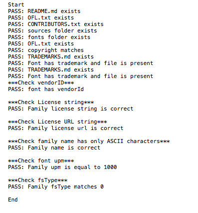
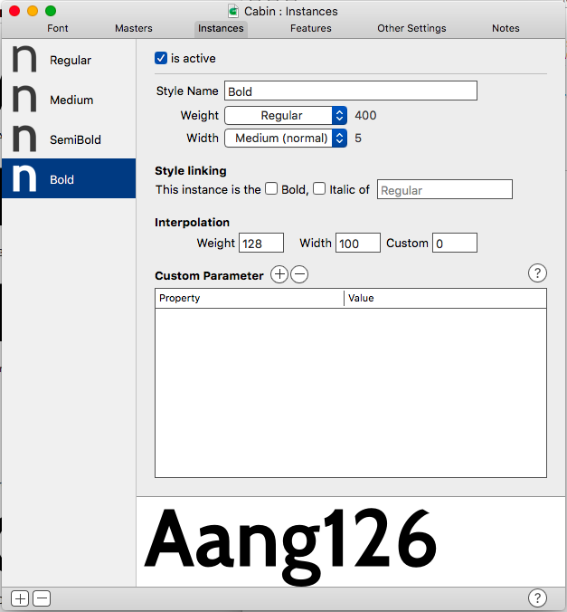

# Updating Existing Font Repositories
Updating repositories to the same standard has to be done on a case by case basis. Here are some examples of good repositories:
- [Neuton](https://github.com/m4rc1e/Neuton)
- [Mirza](https://github.com/Tarobish/Mirza)
- [Nunito](https://github.com/m4rc1e/NunitoFont)

It's worth studying these before you begin.

Older Font repositories vary greatly in quality, therefore it's very difficult to automate the upate process. There are too many variables to take into consideration. We have written some GlyphsApp scripts to check the most important/tedious parts. The scripts are currently a work in progress, they're being updated frequently. You can find them [here](https://github.com/m4rc1e/mf-glyphs-scripts). Once installed, you should get the following drop downs.


## Finding sources.
Locating sources is the most crucial step. Without decent sources, more effort will be required. The following approaches below are listed in priority:

1. Find repository on [Github](https://github.com)
2. Browse old [Google Fonts repositories](https://bitbucket.org/lassefister/old-googlefontdirectory/src/21142f3bf7ad39d89c1c682d30830494ef1c905c/tools/nonhinting/setnonhinting-fonttools.py?at=default&fileviewer=file-view-default)
3. Contact Author and ask for sources
4. Rebuild sources from binary ttfs

The last option should be used as a last resort only.

### Other considerations to keep in mind:
- Do the version numbers match the family which is downloadable from [Google Fonts](https://fonts.google.com)?
- An [md5 checksum](https://www.youtube.com/watch?v=dzdom0Objq4) comparison between the Google Font binary ttfs and your discovered repos ttfs will check if the files are identical.*
- If they don't match, is the repository ahead of the fonts available on Google Fonts?
- This means the repository you discovered could be a work in progress. You must decide whether it is best to work on these or rollback/find a previous version.*


## High level overview of Upgrading a repository

- Reorganise repo into the following folder heirachy (example [Maven Pro](https://github.com/m4rc1e/Maven-Pro)):

```
├── AUTHORS.txt 
├── CONTRIBUTORS.txt 
├── OFL.txt 
├── README.md 
├── fonts
│   ├── MavenPro-Black.ttf
│   ├── MavenPro-Bold.ttf
│   ├── MavenPro-Medium.ttf
│   └── MavenPro-Regular.ttf
├── old 
│   └── version-1.000 
│   ├── DESCRIPTION.en_us.html
│   ├── METADATA.json
│   ├── MavenPro-Black.ttf
│   ├── MavenPro-Bold.ttf
│   ├── MavenPro-Medium.ttf
│   ├── MavenPro-Regular.ttf
│   ├── OFL.txt
│   └── src
│   ├── METADATA_comments.txt
│   ├── MavenPro-Black-VTT.ttf
│   ├── MavenPro-Black.glyphs
│   ├── MavenPro-Black.otf
│   ├── MavenPro-Black.vfb
│   ├── MavenPro-Bold-VTT.ttf
│   ├── MavenPro-Bold.glyphs
│   ├── MavenPro-Bold.otf
│   ├── MavenPro-Bold.vfb
│   ├── MavenPro-Medium-VTT.ttf
│   ├── MavenPro-Medium.glyphs
│   ├── MavenPro-Medium.otf
│   ├── MavenPro-Medium.vfb
│   ├── MavenPro-Regular-VTT.ttf
│   ├── MavenPro-Regular.glyphs
│   ├── MavenPro-Regular.otf
│   ├── MavenPro-Regular.vfb
│   ├── VERSIONS.txt
│   └── fontsquirrel_generator_config.txt
└── sources 
├── MavenPro.glyphs 
└── build
└── instances.yml
```

- The **old** folder should contain the original files from the repo you are working on. They should be subfoldered with the sources version number.
- Every file/folder with an asterisk is essential. Every folder should should be lowercase only.
- **Source** folder should have 1 .glyphs file for Roman weights and 1 for Italics. Condensed, Expanded weights should also have their own .glyphs file as well.
- Incrememnt the .glyphs file version number by += 1.000. eg v2.1000 -> v3.1000
- Implement everything from [ProjectChecklist.md](https://github.com/googlefonts/gf-docs/blob/master/ProjectChecklist.md)
- To test your repo matches the steps mentioned in **ProjectChecklist.md**, run the script **Test repo matches gf-structure**. Fix all the errors until the script passes. 


- Implement everything which is not design intensive from the [Cleanup Checklist](https://docs.google.com/spreadsheets/d/1vFNVR1lf14S1cthPQ59Mav5uZCnWw8_nS3ehKwueUz0/edit#gid=1988585029)
*- MM compatiblity, anchors, kerning can take several days to implement. These should be fixed by the designer if there is enough time.*
- Check [github for issues](https://github.com/google/fonts/issues) on font family and fix them. Again, some issues involving design or extensions will take too long to implement.
- Check and fix vertical metrics. Khaled proposed a [schema](https://groups.google.com/d/msg/googlefonts-discuss/W4PHxnLk3JY/MpyLLY4jAwAJ). We use this schema for older repos. Run the script **Test vertical metrics match Khaled's approach**
- Push repo to your github account
- Send repo link to designer to work on. Link should be included in your daily work log on the [Google Fonts Group Discussion board](https://groups.google.com/forum/#!forum/googlefonts-discuss).
- Designer should send you back a pull request when they're finished. You should merge it back into your repo.
- If you originally forked the project from a Github repo. Ssend the author a PR of the upgraded project, with a note explaining the changes you've made as well as the designers changes. Since the upgrades are quite significant, the author usually accept the PR. By getting the original author to merge our changes, we have consolidated all forks back into the original repo.


## Case Study: Step by step log of Upgrading Cabin
by Marc Foley

Below is typically how I approach upgrading a repository so it is ready for designers to work on. The final repo can be found [here](https://github.com/m4rc1e/Cabin)

### Retrieve sources
- Luckily the project already exists on [github](https://github.com/impallari/Cabin)
- I create a fork the project to my own [github account](https://github.com/m4rc1e/Cabin)
- I clone my fork to my local system

### Tidyup
The following section is each commit I made to my forked repo.

#### commit 1

*gitignore: Added, ignore glyphsapp autosaved files*

commit 74e49f5b9674ec94d67d277262a355afe75d0a1b
Author: Marc Foley <m.foley.88@gmail.com>
Date:   Tue Aug 23 11:26:48 2016 +0200

*old: Moved old v1.005 sources into old folder. Version number was discovered by opening ttf binary in fontlab. Ttf binaries can also be opened in Glyphsapp.*

#### commit 2

*txt files: Readded mandatory txt files to top level of directory. These will need further updating to reflect the new state of the project*

#### commit 3

*Generated .glyphs files from the extremes of MM .vfb file, using this script in [FL](https://github.com/schriftgestalt/Glyphs-Scripts/blob/master/Glyphs%20Export.py). '_' in file name to denote it is a temporary file. We will delete these later, once we have them combined into 1 glyphs file'*

#### commit 4

*Cabin: Both temporary glyphs files have been combined into 1 master .glyphs file. Temp files also deleted*


#### commit 5

*Cabin.glyphs: The script **Test repo matches gf-checklist structure** was run. The script returned there were errors in the font file, fsType, copyright... These errors have been fixed in this commit. I still need to fix errors in the txt files. We will proceed to run the script then fix any errors reported in an interative manner, until the script reports no errors.*


#### commit 6

*CONTRIBUTORS: added, Test repo matches gf-checklist reported this file was missing. The contributors were found by looking in the fonts meta data*

#### commit 7

*OFL.txt | Cabin.glyphs: Updated first line of OFL.txt and .glyphs file copyright field*

#### commit 8

*Cabin.glyphs: Added vendorID. I had to find this by looking at a [Libre Franklin](https://github.com/impallari/Libre-Franklin) which was also made by the same author. We're getting closer ;)*

#### commit 9

*TRADEMARKS.md: added, Script reported this file was missing. Text for this file came from the trademarks field in the font metadata. I am skeptical if this is correct so I will include an issue for it on the repo. I have now successfully made all the checks pass for the script*


*We still need to check the vertical metrics, MM compatibility and see if we need to complete some steps from the other cleanup checklist*

#### commit 10

*Cabin.glyphs: removed panose and glyph order family values. I removed te panose because the panose should be unique for each weight. This field will be included in each instance later. The glyph order was removed because Glyphsapp has its own order function*

#### commit 11

*Cabin.glyphs: Both masters now have weight values. The weight values come from the vertical stem width of the 'H'. We need these values so we can generate instances. In the next step, we'll add the instances*


#### commit 12

*Cabin.glyphs: instances added. To get the correct weight for each instance. We need to measure the 'H' for each weight from the old fonts. The names of each instance have to match this [document](https://docs.google.com/spreadsheets/d/1ckHigO7kRxbm9ZGVQwJ6QJG_HjV_l_IRWJ_xeWnTSBg/edit#gid=0).*


#### commit 13

*Cabin.glyphs: Added vertical metrics to each instance. The script 'Test vertical metrics match Khaled's approach' was used in order to check they are correct. For this font it was very easy. Unfortunately most people do not understand how the three sets of vertical metrics work very well. Refer to [Kalapi's work log on the Google Fonts Group](https://groups.google.com/d/msg/googlefonts-discuss/W4PHxnLk3JY/Uvxm1qj6AgAJ) for an indepth discussion on how it works. It is worth reading all posts on this.*

Each instance and master should have the same Vertical Metrics values!

#### commit 14

*Cabin.glyphs: ran update glyph info. This should rename glyphs according to Glyphsapp internal naming scheme. We can now use Glyphsapp's auto OT features etc*

#### commit 15

*Cabin.glyphs: Added auto OT features and reintroduced smcp feature. Glyphsapp allows us to use auto OT features. The original sources only included smcp and kern. We now have ordn, subs, sups, frac etc*

#### commit 16

*Cabin.glyphs: added 'http://' to meta data fields which need urls. This was reported with the Preflight Fonts script*

#### commit 17

*Cabin.glyphs: Fixed all errors reported in Preflight font script.*


*We now have a clean repo, 1 master .glyphs file with all masters and instances, correct vertical metrics, Better OT features. Luckily the original font was very good quality. Most fonts are not this easy to work on.*

*I will need to repeat all the steps we did on the fonts for the Italics and Condensed files which existed in the old repo. I will also need to generate some tests fonts and run them through font bakery. I leave the font bakery step till the designers have finished working on the repo.*

#### commit 18

*Cabin.glyphs: increased version number from 1.005 to 2.005*

